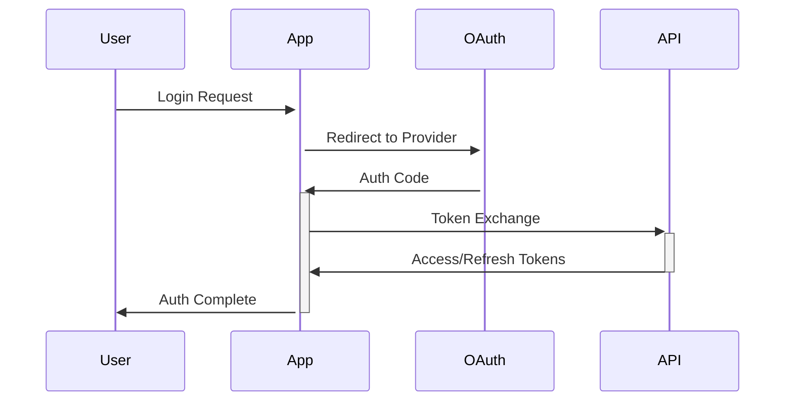
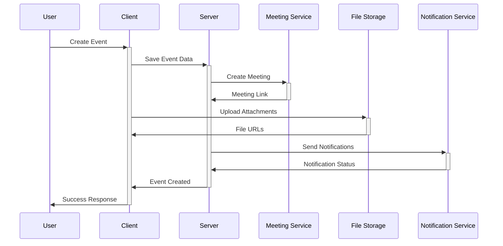

# System Patterns

This document outlines the key architectural patterns, design decisions, and component relationships that form the foundation of our system.

## Architecture Overview

### Layer Structure

```
┌─ UI Layer ─────────────┐
│ - React Components     │
│ - shadcn/ui Elements   │
│ - Client-side State    │
├─ Application Layer ────┤
│ - Next.js App Router   │
│ - API Routes          │
│ - Auth Logic          │
├─ Integration Layer ───┤
│ - Calendar APIs       │
│ - Meeting Services    │
│ - File Storage        │
│ - Real-time Server    │
├─ Data Layer ─────────┤
│ - MongoDB            │
│ - Prisma ORM         │
└────────────────────────┘
```

## Design Patterns

### 1. Component Architecture

- Atomic Design principles for UI components
- Container/Presenter pattern for complex components
- Custom hooks for reusable logic
- Context providers for state management
- File upload components with retry logic
- Real-time collaboration components

### 2. Data Flow Patterns

- Server-side data fetching with Next.js
- Optimistic UI updates for better UX
- Real-time sync with external calendars
- Cached reads with invalidation strategies
- WebSocket connections for live collaboration
- File upload streams with progress tracking

### 3. Authentication Flow



### 4. Event Management Flow



### 5. Real-time Collaboration

- WebSocket connections for live updates
- Operational Transform for concurrent edits
- Presence indicators
- Event status synchronization
- Comment thread management

### 6. File Management

- Chunked upload pattern
- Progressive loading for attachments
- Lazy loading for media content
- Caching strategies for frequently accessed files
- Automatic file type detection and validation

### 7. Error Handling

- Global error boundary pattern
- API error standardization
- Retry policies for transient failures
- Graceful degradation strategies
- Upload resume capability

## Component Relationships

### Core Flows

1. Authentication & Session Management
2. Calendar Integration & Sync
3. Enhanced Event Management
4. Smart Scheduling
5. File Management
6. Real-time Collaboration
7. Notification Delivery

### State Management

- Global app state via React Context
- Form state with controlled components
- File upload progress tracking
- Real-time collaboration state
- Cache management for API responses
- Persistent storage patterns

## API Design Patterns

### RESTful Endpoints

- Resource-based routing
- Standard HTTP methods
- Consistent error responses
- Proper status code usage
- File upload endpoints
- WebSocket endpoints for real-time features

### Authentication & Authorization

- JWT-based auth flow
- Role-based access control
- Token refresh mechanism
- Session management
- File access permissions

## Performance Patterns

### Optimization Strategies

1. Component lazy loading
2. Data prefetching
3. Caching strategies
4. Bundle optimization
5. Image optimization
6. Attachment streaming

### Database Patterns

1. Indexed queries
2. Denormalized data where needed
3. Batch operations
4. Connection pooling
5. File metadata caching

## Monitoring & Logging

- Structured logging pattern
- Error tracking
- Performance metrics
- User activity tracking
- File access monitoring
- Real-time connection status

This document serves as a reference for maintaining consistency in system design and implementation decisions.
